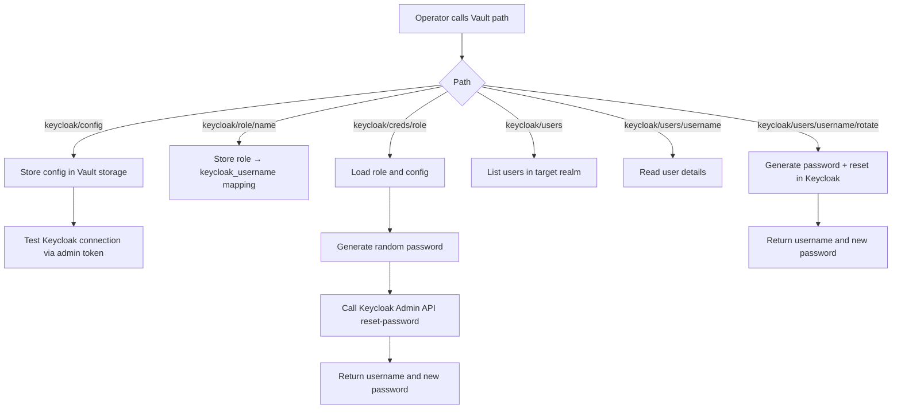

# Vault Plugin: Keycloak Secrets Engine

[](https://github.com/RoFz/vault-plugin-secrets-keycloak/actions/workflows/ci.yml)
[](https://github.com/RoFz/vault-plugin-secrets-keycloak/actions/workflows/codeql.yml)
[](https://github.com/RoFz/vault-plugin-secrets-keycloak/releases/latest)
[](https://go.dev/doc/go1.25)
[](LICENSE)

A HashiCorp Vault secrets engine plugin for Keycloak. Performs on-demand,
audit-logged user password rotation via the Keycloak Admin REST API. Each
rotation generates a cryptographically random password, sets it on the
Keycloak account, and returns the new value — with no credential stored
inside Vault.

## Contents

- [Vault Plugin: Keycloak Secrets Engine](#vault-plugin-keycloak-secrets-engine)
  - [Contents](#contents)
  - [What this plugin does](#what-this-plugin-does)
  - [Process flow](#process-flow)
  - [Installation](#installation)
    - [Download pre-built binaries](#download-pre-built-binaries)
    - [Build from source](#build-from-source)
    - [Deploy to a running Vault instance](#deploy-to-a-running-vault-instance)
      - [Kubernetes / FluxCD (recommended)](#kubernetes--fluxcd-recommended)
    - [Direct manifest method (fallback)](#direct-manifest-method-fallback)
      - [Copy binary to the Vault pod](#copy-binary-to-the-vault-pod)
      - [Register and enable](#register-and-enable)
  - [Configuration](#configuration)
  - [Multiple Keycloak contexts](#multiple-keycloak-contexts)
  - [Expected logs](#expected-logs)
  - [API reference](#api-reference)
  - [Usage](#usage)
  - [Credential lifecycle](#credential-lifecycle)
  - [Contributing](#contributing)
  - [Security](#security)
  - [License](#license)

## What this plugin does

This plugin mounts as a Vault secrets engine and provides endpoints to:

- Configure Keycloak admin access.
- List and read users in the target realm.
- Rotate a user password on demand and return the new value.

## Process flow



## Installation

### Download pre-built binaries

Pre-built binaries for Linux, macOS, Windows, and FreeBSD (amd64 and arm64
where applicable) are published on the
[Releases page](https://github.com/RoFz/vault-plugin-secrets-keycloak/releases).

Download the binary for your platform and verify the SHA-256 checksum from
`checksums.txt`:

```bash
# Example: Linux amd64
curl -LO https://github.com/RoFz/vault-plugin-secrets-keycloak/releases/latest/download/vault-plugin-secrets-keycloak_linux_amd64
curl -LO https://github.com/RoFz/vault-plugin-secrets-keycloak/releases/latest/download/checksums.txt
sha256sum --check --ignore-missing checksums.txt
```

### Build from source

Requires Go 1.25+.

```bash
git clone https://github.com/RoFz/vault-plugin-secrets-keycloak.git
cd vault-plugin-secrets-keycloak
CGO_ENABLED=0 GOOS=linux GOARCH=amd64 \
  go build -o vault-plugin-secrets-keycloak ./cmd/vault-plugin-secrets-keycloak
```

Adjust `GOOS` and `GOARCH` for your target platform.

### Deploy to a running Vault instance

The plugin binary must reside in Vault's
[plugin directory](https://developer.hashicorp.com/vault/docs/plugins/plugin-management#plugin-directory).

**Requirements before deploying:**

- A running Vault instance with a writable plugin directory (e.g. `/vault/plugins`).
- A Vault token with permission to register and enable plugins.
- Keycloak admin credentials for the target realm.

#### Kubernetes / FluxCD (recommended)

Manage the plugin volume using your FluxCD Kustomization and a HelmRelease patch.

1. Add a PVC manifest to the same Flux-managed folder used by your Vault release.
2. Add a patch file targeting your Vault HelmRelease to mount the PVC at `/vault/plugins`.
3. Reference both in the Kustomization (`resources` + `patches`/`patchesStrategicMerge`).
4. Commit and push, then reconcile Flux.

Example HelmRelease patch snippet:

```yaml
apiVersion: helm.toolkit.fluxcd.io/v2
kind: HelmRelease
metadata:
  name: vault
  namespace: vault
spec:
  values:
    server:
      extraVolumes:
        - name: plugin-dir
          persistentVolumeClaim:
            claimName: vault-plugin-pvc
      volumeMounts:
        - name: plugin-dir
          mountPath: /vault/plugins
```

Example Flux reconcile command:

```bash
flux reconcile kustomization <vault-kustomization-name> -n flux-system
```

### Direct manifest method (fallback)

Example PVC manifest for plugin storage:

```yaml
apiVersion: v1
kind: PersistentVolumeClaim
metadata:
  name: vault-plugin-pvc
  namespace: vault
spec:
  accessModes:
    - ReadWriteOnce
  resources:
    requests:
      storage: 1Gi
```

Example StatefulSet volume wiring (required so `/vault/plugins` exists in the pod):

```yaml
spec:
  template:
    spec:
      containers:
        - name: vault
          volumeMounts:
            - name: plugin-dir
              mountPath: /vault/plugins
      volumes:
        - name: plugin-dir
          persistentVolumeClaim:
            claimName: vault-plugin-pvc
```

#### Copy binary to the Vault pod

Copy binary to the active Vault pod:

```bash
kubectl cp ./vault-plugin-secrets-keycloak vault/vault-0:/vault/plugins/vault-plugin-secrets-keycloak
kubectl exec -n vault vault-0 -- chmod 0755 /vault/plugins/vault-plugin-secrets-keycloak
```

Compute SHA256 from inside the pod (used for plugin registration):

```bash
kubectl exec -n vault vault-0 -- sha256sum /vault/plugins/vault-plugin-secrets-keycloak
```

#### Register and enable

Register and enable the plugin:

```bash
SHA256=$(kubectl exec -n vault vault-0 -- sha256sum /vault/plugins/vault-plugin-secrets-keycloak | cut -d' ' -f1)

vault plugin register -sha256="$SHA256" secret vault-plugin-secrets-keycloak
vault secrets enable -path=keycloak vault-plugin-secrets-keycloak
```

## Configuration

Write the plugin configuration (one config per mount):

```bash
vault write keycloak/config \
  url="https://keycloak.example.com" \
  realm="master" \
  target_realm="myrealm" \
  username="admin" \
  password='<admin-password>'
```

## Multiple Keycloak contexts

The plugin stores one config per mount path. To manage multiple Keycloak
deployments or realms, enable the plugin at multiple mount paths:

```bash
vault secrets enable -path=keycloak-appA vault-plugin-secrets-keycloak
vault secrets enable -path=keycloak-appB vault-plugin-secrets-keycloak

vault write keycloak-appA/config \
  url="https://keycloak.example.com" \
  realm="master" \
  target_realm="appA" \
  username="admin" \
  password='<appA-admin-password>'

vault write keycloak-appB/config \
  url="https://keycloak-b.example.com" \
  realm="master" \
  target_realm="appB" \
  username="admin" \
  password='<appB-admin-password>'
```

Script example to configure any mount/context:

```bash
configure_keycloak_mount() {
  local mount_path="$1"
  local url="$2"
  local realm="$3"
  local target_realm="$4"
  local username="$5"
  local password="$6"

  vault secrets enable -path="$mount_path" vault-plugin-secrets-keycloak 2>/dev/null || true
  vault write "$mount_path/config" \
    url="$url" \
    realm="$realm" \
    target_realm="$target_realm" \
    username="$username" \
    password="$password"
}

configure_keycloak_mount keycloak-appA "https://keycloak.example.com" master appA admin '<appA-admin-password>'
configure_keycloak_mount keycloak-appB "https://keycloak-b.example.com" master appB admin '<appB-admin-password>'
```

## Expected logs

Check logs from the active Vault pod:

```bash
kubectl logs -n vault vault-0 --tail=200
```

Filter only plugin-relevant messages:

```bash
kubectl logs -n vault vault-0 --tail=500 \
  | grep -E 'keycloak|password rotated|failed to create Keycloak client|connection test failed|failed to initialise'
```

Operational/healthy examples:

- `keycloak secrets engine loaded successfully`
- `keycloak config saved and connection test succeeded`
- `password rotated successfully` with fields such as `role` and `keycloak_username`

Error examples:

- `keycloak secrets engine failed to initialise`
- `failed to create Keycloak client`
- `keycloak config saved but connection test failed`
- `failed to rotate password`

## API reference

All paths below are relative to the mount point (default `keycloak/`).

### `config`

Configure the Keycloak backend. The plugin authenticates as an admin user
via the Resource Owner Password Credentials (ROPC) grant.

| Method | Vault CLI |
| --- | --- |
| Create / Update | `vault write keycloak/config ...` |
| Read | `vault read keycloak/config` |
| Delete | `vault delete keycloak/config` |

**Parameters:**

| Parameter | Type | Required | Default | Description |
| --- | --- | --- | --- | --- |
| `url` | string | yes | — | Base URL of the Keycloak server. |
| `realm` | string | yes | — | Auth realm used to obtain admin tokens (typically `master`). |
| `target_realm` | string | no | value of `realm` | Realm whose users will be managed. |
| `client_id` | string | no | `admin-cli` | OIDC client used for the ROPC grant. |
| `username` | string | yes | — | Keycloak admin username. |
| `password` | string | yes | — | Password for the admin user. |

### `role/<name>`

Map a Vault role name to a Keycloak username. Used by the alpha
`creds/<name>` lease-based path.

| Method | Vault CLI |
| --- | --- |
| Create / Update | `vault write keycloak/role/<name> ...` |
| Read | `vault read keycloak/role/<name>` |
| Delete | `vault delete keycloak/role/<name>` |
| List | `vault list keycloak/role` |

**Parameters:**

| Parameter | Type | Required | Default | Description |
| --- | --- | --- | --- | --- |
| `name` | string | yes | — | Vault role name. |
| `keycloak_username` | string | yes | — | Keycloak username whose password will be rotated. |
| `ttl` | duration | no | `3600` (1 h) | Lease duration before automatic revocation. |
| `max_ttl` | duration | no | `86400` (24 h) | Maximum lease duration. |

### `users/`

| Method | Vault CLI |
| --- | --- |
| List | `vault list keycloak/users` |

Returns the usernames of all users in the target realm (up to 500).

### `users/<username>`

| Method | Vault CLI |
| --- | --- |
| Read | `vault read keycloak/users/<username>` |

Returns the user's username, internal Keycloak ID, enabled status, email,
first name, and last name.

### `users/<username>/rotate`

| Method | Vault CLI |
| --- | --- |
| Update | `vault write -force keycloak/users/<username>/rotate` |

Generates a cryptographically random password (`crypto/rand`), sets it on
the Keycloak user via the Admin REST API, and returns `{ username, password }`.
The previous password is immediately invalidated. No lease is created.

### `creds/<name>` (alpha)

| Method | Vault CLI |
| --- | --- |
| Read | `vault read keycloak/creds/<name>` |

Generates a password and sets it on the Keycloak user bound to `<name>`.
Returns `{ username, password }` with a Vault lease. On lease revocation the
password is rotated again to a discarded value, invalidating the issued
credential. On lease renewal the TTL is extended without rotation.

> **Alpha:** automatic lease expiry and revocation have not been fully
> validated end-to-end. See the [Credential lifecycle](#credential-lifecycle)
> section for caveats.

## Usage

List all users in the configured target realm:

```bash
vault list keycloak/users
```

Read a specific user's details:

```bash
vault read keycloak/users/<keycloak-username>
```

Rotate a user's password and return the new value:

```bash
vault write -force keycloak/users/<keycloak-username>/rotate
```

The command generates a cryptographically random password (`crypto/rand`),
sets it on the Keycloak account via the Admin REST API, and returns
`{ username, password }`. The previous password is immediately invalidated.
No lease is created; Vault retains no record of the issued credential.

## Credential lifecycle

The supported rotation path is fire-and-forget via
`vault write -force keycloak/users/<username>/rotate`.

The returned password remains valid in Keycloak indefinitely until the next
explicit rotation call. Vault retains no record of it and performs no
automatic revocation. Every call is recorded in the Vault audit log
(caller identity, mount path, timestamp).

> **Alpha — not recommended for production use yet:**
> The plugin also implements a role-based, lease-bound issuance path
> (`vault read keycloak/creds/<role>`) where Vault manages a TTL and
> automatically invalidates the credential on expiry by re-rotating the
> password to a discarded value. Automatic lease expiry and revocation
> have not been fully validated end-to-end and are considered alpha.
> See `path_credentials.go` in the source for implementation details.
>
> **Alpha caveat — Vault availability at revocation time:**
> Keycloak has no awareness of Vault leases. If Vault is unavailable when a
> lease TTL expires, the revocation callback is deferred and the issued
> password remains valid in Keycloak until Vault resumes. This is a known
> limitation of the alpha lease path and does not affect the supported
> fire-and-forget rotation path.

## Contributing

See [CONTRIBUTING.md](CONTRIBUTING.md) for development setup, testing, linting,
and the Conventional Commits guidelines used in this project.

## Security

To report a security vulnerability, please use
[GitHub Security Advisories](https://github.com/RoFz/vault-plugin-secrets-keycloak/security/advisories/new)
rather than a public issue. See [SECURITY.md](SECURITY.md) for the full policy.

## License

[Apache License 2.0](LICENSE)
