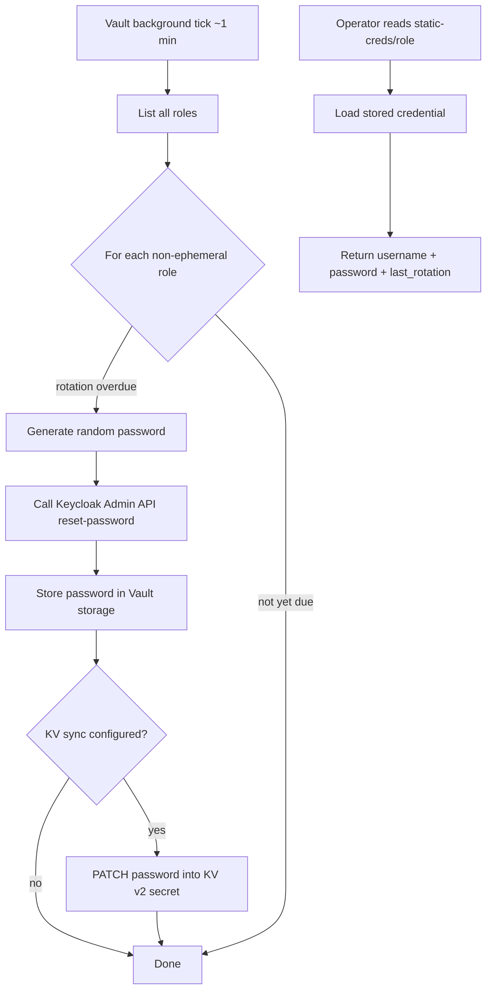
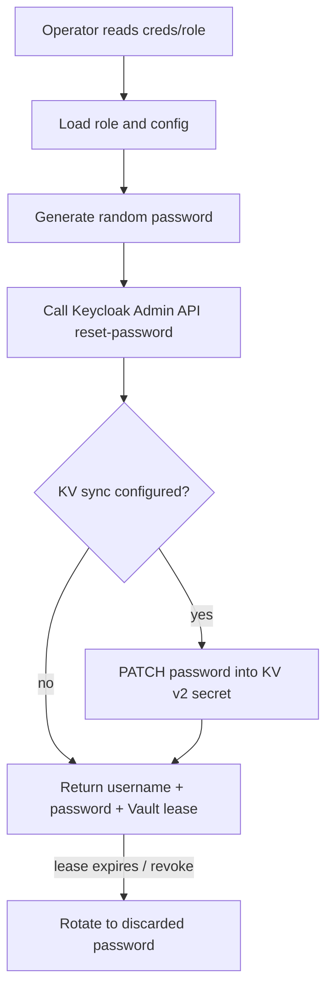
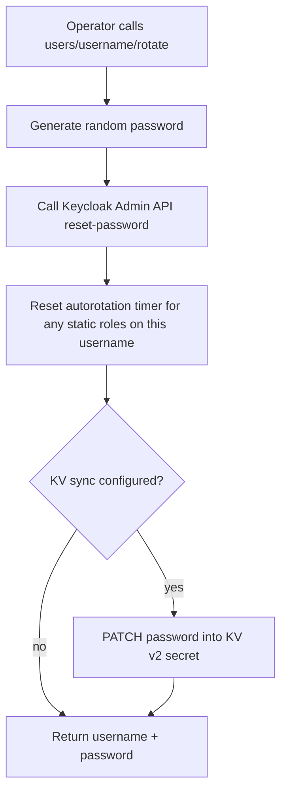

# Vault Plugin: Keycloak Secrets Engine

[](https://github.com/RoFz/vault-plugin-secrets-keycloak/actions/workflows/ci.yml)
[](https://github.com/RoFz/vault-plugin-secrets-keycloak/actions/workflows/codeql.yml)
[](tests/TESTING.md#testing-strategy)
[](https://github.com/RoFz/vault-plugin-secrets-keycloak/releases/latest)
[](https://go.dev/doc/go1.26)
[](LICENSE)
[](https://www.bestpractices.dev/projects/12363)

A HashiCorp Vault secrets engine plugin for Keycloak. Manages Keycloak user
passwords via the Admin REST API: on-demand rotation, lease-bound ephemeral
credentials, and background autorotation on a configurable schedule — all
audit-logged through Vault.

## Contents

- [Vault Plugin: Keycloak Secrets Engine](#vault-plugin-keycloak-secrets-engine)
  - [Contents](#contents)
  - [What this plugin does](#what-this-plugin-does)
  - [What this plugin does not do](#what-this-plugin-does-not-do)
  - [Process flow](#process-flow)
  - [Compatibility](#compatibility)
  - [Installation](#installation)
    - [Download pre-built binaries](#download-pre-built-binaries)
    - [Build from source](#build-from-source)
    - [Deploy to a running Vault instance](#deploy-to-a-running-vault-instance)
      - [Kubernetes / FluxCD (recommended)](#kubernetes--fluxcd-recommended)
    - [Direct manifest method (fallback)](#direct-manifest-method-fallback)
      - [Copy binary to the Vault pod](#copy-binary-to-the-vault-pod)
      - [Register and enable](#register-and-enable)
      - [Upgrade or remove](#upgrade-or-remove)
  - [Configuration](#configuration)
    - [KV v2 sync (optional)](#kv-v2-sync-optional)
      - [Creating the KV sync token](#creating-the-kv-sync-token)
  - [Multiple Keycloak contexts (untested)](#multiple-keycloak-contexts-untested)
  - [Expected logs](#expected-logs)
  - [API reference](#api-reference)
    - [`config`](#config)
    - [`roles/<name>`](#rolesname)
    - [`users/`](#users)
    - [`users/<username>`](#usersusername)
    - [`users/<username>/rotate`](#usersusernamerotate)
    - [`static-creds/<name>`](#static-credsname)
    - [`creds/<name>`](#credsname)
  - [Usage](#usage)
    - [Create and use a static role](#create-and-use-a-static-role)
    - [Create and use an ephemeral role](#create-and-use-an-ephemeral-role)
    - [Rotate on demand](#rotate-on-demand)
  - [Credential lifecycle](#credential-lifecycle)
  - [Security model](#security-model)
  - [Contributing](#contributing)
  - [Security](#security)
  - [License](#license)

## What this plugin does

This plugin mounts as a Vault secrets engine and provides endpoints to:

- **List and read users** in the target Keycloak realm.
- **Rotate a user password on demand** via `users/<username>/rotate`
  (fire-and-forget — no lease, no expiration). The new password is
  returned to the caller and remains valid in Keycloak until the next
  rotation.
- **Autorotate passwords on a schedule** via static roles (v0.3.0+).
  A background task rotates the password every `rotation_period` and
  stores the current credential in Vault. Read it any time from
  `static-creds/<role>` — always the same value until the next rotation.
- **Sync rotated passwords to a KV v2 secret** (v0.2.0+) — optionally
  PATCH the new password into another Vault KV v2 path after any rotation
  (useful for Kubernetes secret operators).
- **Issue ephemeral, lease-bound credentials** via `creds/<role>`.
  Each read generates a **new** password immediately set on the Keycloak
  account. The credential carries a Vault lease; on expiry or explicit
  revocation, the plugin resets the password to a discarded value.

## What this plugin does not do

- **Create or delete Keycloak users.** The plugin only manages passwords
  for existing users.
- **Store passwords for ephemeral roles.** Ephemeral credentials issued
  via `creds/<role>` are returned to the caller only and are not retained
  inside Vault after the response.

## Process flow

### Static role (autorotation)



### Ephemeral role



### On-demand rotation



## Compatibility

Every change is tested in CI against a matrix of Vault and Keycloak versions; the
full integration suite (configure, rotate, verify, KV sync) runs against each
pair. The plugin tracks the last MPL-2.0 Vault line, the latest 1.x, and the
latest 2.x, plus the latest Keycloak.

| Component | Tested versions |
| --- | --- |
| Vault | `1.14.10` (last MPL-2.0), `1.21.4` (latest 1.x), `2.0.2` (latest 2.x) |
| Keycloak | `26.6.3` (latest) |

The exact pinned image tags are maintained in
[`tests/versions.env`](tests/versions.env). Other versions may work but are not
exercised by the suite.

## Installation

### Download pre-built binaries

Pre-built binaries for Linux, macOS, Windows, and FreeBSD (amd64, arm64, and
386 where applicable) are published on the
[Releases page](https://github.com/RoFz/vault-plugin-secrets-keycloak/releases).

Each release is signed with [cosign](https://docs.sigstore.dev/) keyless
signing: `checksums.txt` is signed (the signature bundle is
`checksums.txt.sigstore.json`), and every binary is listed in `checksums.txt`.
Verify the **signature** (provenance) first, then the **checksum** (integrity).
The binary file name embeds the release version
(`vault-plugin-secrets-keycloak_<version>_<os>_<arch>`), so resolve the latest
version first:

```bash
# Example: Linux amd64 (requires cosign and jq)
VERSION=$(curl -fsSL https://api.github.com/repos/RoFz/vault-plugin-secrets-keycloak/releases/latest | jq -r .tag_name)
BINARY="vault-plugin-secrets-keycloak_${VERSION#v}_linux_amd64"
BASE="https://github.com/RoFz/vault-plugin-secrets-keycloak/releases/download/${VERSION}"

curl -fLO "${BASE}/${BINARY}"
curl -fLO "${BASE}/checksums.txt"
curl -fLO "${BASE}/checksums.txt.sigstore.json"

# 1. Provenance: verify checksums.txt was signed by this repo's release workflow.
cosign verify-blob \
  --bundle checksums.txt.sigstore.json \
  --certificate-identity "https://github.com/RoFz/vault-plugin-secrets-keycloak/.github/workflows/release-please.yml@refs/heads/main" \
  --certificate-oidc-issuer "https://token.actions.githubusercontent.com" \
  checksums.txt

# 2. Integrity: verify the downloaded binary against the signed checksums.
sha256sum --check --ignore-missing checksums.txt
```

> The signature uses the Sigstore bundle format (`checksums.txt.sigstore.json`);
> the command above is verified with cosign v2.4.3 and v3.0.6.

### Build from source

Requires Go 1.26+.

```bash
git clone https://github.com/RoFz/vault-plugin-secrets-keycloak.git
cd vault-plugin-secrets-keycloak
CGO_ENABLED=0 GOOS=linux GOARCH=amd64 \
  go build -o vault-plugin-secrets-keycloak ./cmd/vault-plugin-secrets-keycloak
```

Adjust `GOOS` and `GOARCH` for your target platform.

### Deploy to a running Vault instance

The plugin binary must reside in Vault's
[plugin directory](https://developer.hashicorp.com/vault/docs/plugins/plugin-management#plugin-directory).

**Requirements before deploying:**

- A running Vault instance with a writable plugin directory (e.g. `/vault/plugins`).
- A Vault token with permission to register and enable plugins.
- Keycloak admin credentials for the target realm.

#### Kubernetes / FluxCD (recommended)

Manage the plugin volume using your FluxCD Kustomization and a HelmRelease patch.

1. Add a PVC manifest to the same Flux-managed folder used by your Vault release.
2. Add a patch file targeting your Vault HelmRelease to mount the PVC at `/vault/plugins`.
3. Reference both in the Kustomization (`resources` + `patches`/`patchesStrategicMerge`).
4. Commit and push, then reconcile Flux.

Example HelmRelease patch snippet:

```yaml
apiVersion: helm.toolkit.fluxcd.io/v2
kind: HelmRelease
metadata:
  name: vault
  namespace: vault
spec:
  values:
    server:
      extraVolumes:
        - name: plugin-dir
          persistentVolumeClaim:
            claimName: vault-plugin-pvc
      volumeMounts:
        - name: plugin-dir
          mountPath: /vault/plugins
```

Example Flux reconcile command:

```bash
flux reconcile kustomization <vault-kustomization-name> -n flux-system
```

### Direct manifest method (fallback)

Example PVC manifest for plugin storage:

```yaml
apiVersion: v1
kind: PersistentVolumeClaim
metadata:
  name: vault-plugin-pvc
  namespace: vault
spec:
  accessModes:
    - ReadWriteOnce
  resources:
    requests:
      storage: 1Gi
```

Example StatefulSet volume wiring (required so `/vault/plugins` exists in the pod):

```yaml
spec:
  template:
    spec:
      containers:
        - name: vault
          volumeMounts:
            - name: plugin-dir
              mountPath: /vault/plugins
      volumes:
        - name: plugin-dir
          persistentVolumeClaim:
            claimName: vault-plugin-pvc
```

#### Copy binary to the Vault pod

Copy binary to the active Vault pod:

```bash
kubectl cp ./vault-plugin-secrets-keycloak vault/vault-0:/vault/plugins/vault-plugin-secrets-keycloak
kubectl exec -n vault vault-0 -- chmod 0755 /vault/plugins/vault-plugin-secrets-keycloak
```

Compute SHA256 from inside the pod (used for plugin registration):

```bash
kubectl exec -n vault vault-0 -- sha256sum /vault/plugins/vault-plugin-secrets-keycloak
```

In an HA cluster with a shared plugin volume, verify all Vault server pods see
the same binary:

```bash
for pod in $(kubectl get pods -n vault -l component=server -o name); do
  echo "$pod:"
  kubectl exec -n vault "$pod" -- sha256sum /vault/plugins/vault-plugin-secrets-keycloak
done
```

All SHA256 values must match before proceeding.

#### Register and enable

Register and enable the plugin (the `-version` flag must match the version
reported by the binary):

```bash
SHA256=$(kubectl exec -n vault vault-0 -- sha256sum /vault/plugins/vault-plugin-secrets-keycloak | cut -d' ' -f1)
VERSION="vX.Y.Z"

vault plugin register -sha256="$SHA256" -version="$VERSION" secret vault-plugin-secrets-keycloak
vault secrets enable -path=keycloak vault-plugin-secrets-keycloak
```

#### Upgrade or remove

To upgrade or remove the plugin, first disable the secrets engine, then
deregister the plugin with the version it was registered under:

```bash
vault secrets disable keycloak/
vault plugin deregister -version="$VERSION" secret vault-plugin-secrets-keycloak
```

## Configuration

Write the plugin configuration (one config per mount):

```bash
vault write keycloak/config \
  url="https://keycloak.example.com" \
  realm="master" \
  target_realm="myrealm" \
  master_admin_username="admin" \
  master_admin_password='<admin-password>'
```

### KV v2 sync (optional)

When a password is rotated — via `static-creds` autorotation,
`creds/<role>`, or `users/<username>/rotate` — the plugin can optionally
PATCH the new password into a KV v2 secret in Vault. This is useful for
syncing rotated credentials to Kubernetes secrets (via the Vault Secrets
Operator or External Secrets Operator).

To enable KV sync, add the KV fields to the config:

```bash
vault write keycloak/config \
  url="https://keycloak.example.com" \
  master_admin_username="admin" \
  master_admin_password='<admin-password>' \
  kv_mount_path="k8s" \
  kv_secret_path="keycloak/realm-users" \
  kv_token="hvs.<token>" \
  kv_api_addr="https://vault.vault.svc.cluster.local:8200"
```

Then set `kv_password_key` on the role:

```bash
vault write keycloak/roles/myuser \
  keycloak_username="myuser" \
  rotation_period="24h" \
  kv_password_key="myuser-password"
```

After each rotation, the plugin PATCHes `k8s/data/keycloak/realm-users`
with `{ "myuser-password": "<new-pw>" }`. If the KV secret does not yet
exist, a PUT (create) is used instead.

KV sync failures are non-fatal — the rotation still succeeds and a warning
is returned in the response.

#### Creating the KV sync token

The KV sync token needs `create`, `update`, and `patch` capabilities on the
target KV data path. Create a scoped policy and an orphan token:

```bash
vault policy write keycloak-kv-sync - <<'POLICY'
path "k8s/data/keycloak/realm-users" {
  capabilities = ["create", "update", "patch"]
}
POLICY

vault token create \
  -policy=keycloak-kv-sync \
  -orphan \
  -explicit-max-ttl=8760h \
  -ttl=8760h \
  -display-name=keycloak-kv-sync
```

> **`explicit-max-ttl` vs `max_lease_ttl`:** The token auth mount has a
> `max_lease_ttl` (default 768h / 32 days) that caps the initial TTL.
> The `-explicit-max-ttl` flag sets the absolute maximum lifetime of the
> token, up to which it can be renewed. The token must be renewed before
> its current TTL expires. For example, with `-ttl=8760h` and a mount
> `max_lease_ttl` of 768h, the token is created with a 768h TTL but can
> be renewed repeatedly until the `explicit-max-ttl` of 8760h is reached.

Adjust the policy path to match your `kv_mount_path` and `kv_secret_path`.

## Multiple Keycloak contexts (untested)

> **Untested:** multiple mount paths are expected to work based on how Vault
> handles plugin mounts, but this has not been validated against multiple
> Keycloak realms or deployments.

The plugin stores one config per mount path. To manage multiple Keycloak
deployments or realms, enable the plugin at multiple mount paths:

```bash
vault secrets enable -path=keycloak-appA vault-plugin-secrets-keycloak
vault secrets enable -path=keycloak-appB vault-plugin-secrets-keycloak

vault write keycloak-appA/config \
  url="https://keycloak.example.com" \
  realm="master" \
  target_realm="appA" \
  master_admin_username="admin" \
  master_admin_password='<appA-admin-password>'

vault write keycloak-appB/config \
  url="https://keycloak-b.example.com" \
  realm="master" \
  target_realm="appB" \
  master_admin_username="admin" \
  master_admin_password='<appB-admin-password>'
```

## Expected logs

Check logs from the active Vault pod:

```bash
kubectl logs -n vault vault-0 --tail=200
```

Filter only plugin-relevant messages:

```bash
kubectl logs -n vault vault-0 --tail=500 \
  | grep -E 'keycloak|password rotated|static credential rotated|failed to create Keycloak client|connection test failed|failed to initialise'
```

Operational/healthy examples:

- `keycloak secrets engine loaded successfully`
- `keycloak config saved and connection test succeeded`
- `password rotated successfully` with fields such as `role` and `keycloak_username`
- `static credential rotated` with fields such as `role` and `keycloak_username`
- `static cred timer reset after manual rotation` with fields such as `role` and `keycloak_username`
- `kv secret updated successfully` with fields such as `kv_secret_path` and `kv_password_key`

Error examples:

- `keycloak secrets engine failed to initialise`
- `failed to create Keycloak client`
- `keycloak config saved but connection test failed`
- `failed to rotate password`
- `periodic: rotation failed` with fields such as `role` and `error`
- `kv sync failed after password rotation`

## API reference

All paths below are relative to the mount point (default `keycloak/`).

### `config`

Configure the Keycloak backend. The plugin authenticates as an admin user
via the Resource Owner Password Credentials (ROPC) grant.

Writes are validated: `url`, `master_admin_username`, and
`master_admin_password` must be present on the merged configuration, so an
incomplete config can never be stored. Partial updates that only touch
optional fields keep the stored required fields.

| Method | Vault CLI |
| --- | --- |
| Create / Update | `vault write keycloak/config ...` |
| Read | `vault read keycloak/config` |
| Delete | `vault delete keycloak/config` |

**Parameters:**

| Parameter | Type | Required | Default | Description |
| --- | --- | --- | --- | --- |
| `url` | string | yes | — | Base URL of the Keycloak server. |
| `realm` | string | no | `master` | Auth realm used to obtain admin tokens. |
| `target_realm` | string | no | value of `realm` | Realm whose users will be managed. |
| `client_id` | string | no | `admin-cli` | OIDC client used for the ROPC grant. |
| `master_admin_username` | string | yes | — | Username of the master realm admin. |
| `master_admin_password` | string | yes | — | Password of the master realm admin. |
| `kv_mount_path` | string | no | — | KV v2 mount name for KV sync after rotation. |
| `kv_secret_path` | string | no | — | Path within the KV v2 mount to PATCH. |
| `kv_api_addr` | string | no | `https://127.0.0.1:8200` | Vault API address for KV sync requests. |
| `kv_tls_skip_verify` | bool | no | `false` | Skip TLS verification for the KV API. |
| `kv_token` | string | no | — | Vault token with create/update/patch on the KV data path. |

### `roles/<name>`

Map a Vault role name to a Keycloak username. A role is either **static**
(autorotated, default) or **ephemeral** (lease-bound), selected by the
`ephemeral` flag. A role can be converted between modes by rewriting it; see
**Mode conversion** below for what happens to the managed password.

| Method | Vault CLI |
| --- | --- |
| Create / Update | `vault write keycloak/roles/<name> ...` |
| Read | `vault read keycloak/roles/<name>` |
| Delete | `vault delete keycloak/roles/<name>` |
| List | `vault list keycloak/roles` |

**Parameters:**

| Parameter | Type | Required | Default | Description |
| --- | --- | --- | --- | --- |
| `name` | string | yes | — | Vault role name (lowercase). |
| `keycloak_username` | string | yes | — | Keycloak username whose password will be rotated. |
| `ephemeral` | bool | no | `false` | Role mode. `false` = static autorotation; `true` = ephemeral lease-bound. |
| `rotation_period` | duration | static only | — | How often to autorotate. Minimum 30 minutes. Required when `ephemeral=false`. |
| `ttl` | duration | ephemeral only | — | Lease duration. Minimum 1 minute. Required when `ephemeral=true`. |
| `max_ttl` | duration | ephemeral only | — | Maximum lease duration. Must be ≥ `ttl`. Required when `ephemeral=true`. |
| `kv_password_key` | string | no | — | KV v2 key to PATCH with the new password after each rotation. |

**Validation rules:**

| Condition | Result |
| --- | --- |
| `ephemeral=false` and `rotation_period` missing or < 30 min | Error |
| `ephemeral=false` and `ttl` or `max_ttl` provided | Error |
| `ephemeral=true` and `ttl` missing or < 1 min | Error |
| `ephemeral=true` and `max_ttl` missing | Error |
| `ephemeral=true` and `max_ttl` < `ttl` | Error |
| `ephemeral=true` and `rotation_period` provided | Error |
| `keycloak_username` already mapped by a static role | Error |
| writing a static role whose `keycloak_username` is mapped by any other role | Error |

**Username exclusivity:** a Keycloak username may be shared only between
ephemeral roles (the pre-v0.3.0 behaviour). A static role's username must not
be mapped by any other role: independent rotation paths on one account would
silently invalidate each other's stored password. Conflicting role pairs that
already exist in storage from older versions are not autorotated; the plugin
logs an error and skips them until the conflict is resolved.

**Immediate rotation on write:** the plugin performs one rotation, before the
role is persisted, whenever the write creates a static role, changes a static
role's `keycloak_username`, or converts a role to static. This guarantees
`static-creds/<name>` is readable straight away and always returns a
username/password pair that is actually set in Keycloak. If Keycloak is
unreachable, the write fails and the previous role definition (if any) is left
untouched. Note the consequence: **writing a static role immediately replaces
the target user's existing password.**

**Mode conversion:**

- *Ephemeral to static*: the role is rotated immediately (see above); stale
  `ttl`/`max_ttl` values are cleared.
- *Static to ephemeral*: the managed password is rotated to a **discarded**
  value (never stored or returned) and the stored credential is deleted; the
  stale `rotation_period` is cleared. The conversion fails, leaving the role
  static and managed, if Keycloak is unreachable.

**On delete:** deleting a static role also rotates the user's password to a
discarded value: nobody manages that credential afterwards, so leaving it
valid would dangle an unrotated secret forever. The delete fails if Keycloak
is unreachable (retry once it is back). Deleting an ephemeral role does not
rotate; outstanding leases keep their own revocation lifecycle. The discard is
skipped when another (pre-v0.3.0) role still maps the same username.

**Backward compatibility:** every role written by v0.1.x / v0.2.x (no
`ephemeral` or `rotation_period` field, regardless of its `ttl` values) is
automatically treated as `ephemeral=true`: it keeps working with
`creds/<name>` unchanged and is **never** autorotated. To opt a legacy role
into autorotation, rewrite it with `ephemeral=false` (or omit `ephemeral`)
and a `rotation_period`.

### `users/`

| Method | Vault CLI |
| --- | --- |
| List | `vault list keycloak/users` |

Returns the usernames of all users in the target realm (up to 500).

### `users/<username>`

| Method | Vault CLI |
| --- | --- |
| Read | `vault read keycloak/users/<username>` |

Returns the user's username, internal Keycloak ID, enabled status, email,
first name, and last name.

### `users/<username>/rotate`

| Method | Vault CLI |
| --- | --- |
| Update | `vault write -force keycloak/users/<username>/rotate` |

Generates a cryptographically random password, sets it on the Keycloak user
via the Admin REST API, and returns `{ username, password }`. The previous
password is immediately invalidated. No lease is created.

If any static roles map to this username, their stored credential and
autorotation timer are updated to match the new password, so the next
autorotation is deferred by a full `rotation_period` from now.

**Optional parameter:**

| Parameter | Type | Required | Default | Description |
| --- | --- | --- | --- | --- |
| `kv_password_key` | string | no | — | KV v2 key to PATCH with the new password. Omit to skip KV sync. |

### `static-creds/<name>`

| Method | Vault CLI |
| --- | --- |
| Read | `vault read keycloak/static-creds/<name>` |

Returns the current autorotated password for a **static** (non-ephemeral) role.
No lease is created — multiple reads return the same credential until the next
rotation. The password is stored in Vault's encrypted storage (seal-wrapped on
Enterprise).

Returns an error if the role is ephemeral (use `creds/<name>` instead) or if
no credential has been stored yet (rotation pending).

**Response fields:**

| Field | Description |
| --- | --- |
| `username` | Keycloak username. |
| `password` | Current password. Valid until the next rotation. |
| `last_rotation` | RFC 3339 timestamp of the most recent rotation. |
| `rotation_period` | Configured rotation interval in seconds. |

### `creds/<name>`

| Method | Vault CLI |
| --- | --- |
| Read | `vault read keycloak/creds/<name>` |

Generates a **new** password and immediately sets it on the Keycloak user
bound to the role. Returns `{ username, password }` with a Vault lease. Each
read invalidates the previous password. On lease expiry or explicit
revocation, the password is rotated again to a discarded value.

Only works with **ephemeral** roles (`ephemeral=true`). Returns an error for
static roles (use `static-creds/<name>` instead).

> **Alpha:** the revoke/renew logic is unit-tested, but automatic lease expiry
> and revocation have not been validated end-to-end against a live Vault lease.
> See the [Credential lifecycle](#credential-lifecycle) section for caveats.

## Usage

List all users in the configured target realm:

```bash
vault list keycloak/users
```

Read a specific user's details:

```bash
vault read keycloak/users/<keycloak-username>
```

### Create and use a static role

Create a static role — Keycloak is contacted immediately for the first rotation:

```bash
vault write keycloak/roles/myapp \
  keycloak_username="myapp-svc" \
  rotation_period="24h"
```

Read the current password (same value on every read until the next rotation):

```bash
vault read keycloak/static-creds/myapp
```

Example output:

```text
Key               Value
---               -----
username          myapp-svc
password          dGhpcyBpcyBhIHRlc3Q...
last_rotation     2026-04-01T12:00:00Z
rotation_period   86400
```

### Create and use an ephemeral role

Create an ephemeral role:

```bash
vault write keycloak/roles/myapp-ephem \
  keycloak_username="myapp-svc" \
  ephemeral=true \
  ttl="1h" \
  max_ttl="24h"
```

Each read generates a **new** password and invalidates the previous one:

```bash
vault read keycloak/creds/myapp-ephem
```

### Rotate on demand

Rotate a user's password outside of any role:

```bash
vault write -force keycloak/users/<keycloak-username>/rotate
```

## Credential lifecycle

### Static roles (autorotation)

The plugin's background task runs on Vault's periodic tick (~1 minute). For
each static role it checks whether `time.since(last_rotation) >= rotation_period`.
If so, it:

1. Generates a new random password (`crypto/rand`).
2. Sets it on the Keycloak user via the Admin REST API.
3. Stores the new password and timestamp in Vault's encrypted storage.
4. Optionally PATCHes the KV v2 secret.

If Vault was down and a rotation became overdue, it is performed immediately
on the next tick (catch-up logic). If the plugin crashes between setting the
password in Keycloak and storing it, the overdue check still holds on the
next tick and the rotation simply runs again.

All rotation paths (scheduled, manual, and role-write) are serialized behind
a single rotation lock, so the password stored in Vault is always the one
last set in Keycloak; two interleaved rotations can never leave storage and
Keycloak disagreeing.

Calling `users/<username>/rotate` on a username that belongs to one or more
static roles resets those roles' autorotation timers to now, so the next
scheduled rotation is deferred by a full `rotation_period`.

### Ephemeral roles

Each `vault read keycloak/creds/<name>` generates a new password immediately,
replacing any previously issued credential for that user. The credential is
returned with a Vault lease; on expiry or explicit revocation, the password is
rotated to a discarded value, invalidating it on both sides.

> **Alpha — not recommended for production use yet:**
> The revoke/renew callbacks are unit-tested, but automatic lease expiry and
> revocation have not been validated end-to-end against a live Vault lease.
>
> **Alpha caveat — Vault availability at revocation time:**
> Keycloak has no awareness of Vault leases. If Vault is unavailable when a
> lease TTL expires, the revocation callback is deferred and the issued
> password remains valid in Keycloak until Vault resumes. This does not affect
> the static autorotation or fire-and-forget rotation paths.

### Fire-and-forget rotation

`vault write -force keycloak/users/<username>/rotate` is a stateless,
one-shot rotation. The returned password remains valid in Keycloak until
the next explicit call. Vault retains no record of it. Every call is recorded
in the Vault audit log (caller identity, mount path, timestamp).

## Security model

Facts worth knowing before granting policies on this mount:

- **Static role passwords are stored in Vault storage.** This is inherent to
  static roles (the same password must be served until the next rotation).
  Entries live under `static-creds/*`, are encrypted by Vault's storage
  barrier, and are declared for [seal wrapping](https://developer.hashicorp.com/vault/docs/enterprise/sealwrap)
  (extra HSM-backed encryption on Vault Enterprise). Ephemeral credentials
  are never stored.
- **Write access to `roles/*` is a password-reset capability.** Creating or
  rewriting a static role immediately replaces the target user's password in
  Keycloak. Grant `create`/`update` on `roles/*` only to operators who may
  reset the mapped accounts' passwords.
- **Deleting a static role invalidates its password** (discard rotation), so
  `delete` on `roles/*` is also a credential-invalidation capability.
- **The configured admin credential is high-value.** The plugin authenticates
  with a named admin via the ROPC grant. Use a dedicated service account with
  the narrowest role that can manage users in the target realm, not a full
  master admin. The password and `kv_token` are never returned by config
  reads and the config entry is seal-wrapped.
- **Every rotation is audit-logged** by Vault (caller identity, mount path,
  timestamp), and the plugin logs each rotation with role and username
  (never the password).

## Contributing

See [CONTRIBUTING.md](CONTRIBUTING.md) for development setup, testing, linting,
and the Conventional Commits guidelines used in this project.

## Security

To report a security vulnerability, please use
[GitHub Security Advisories](https://github.com/RoFz/vault-plugin-secrets-keycloak/security/advisories/new)
rather than a public issue. See [SECURITY.md](SECURITY.md) for the full policy.

## License

[Apache License 2.0](LICENSE)
