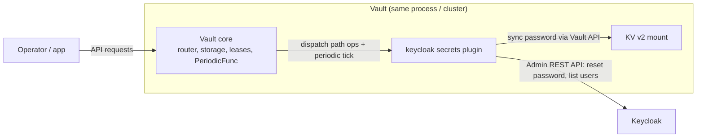
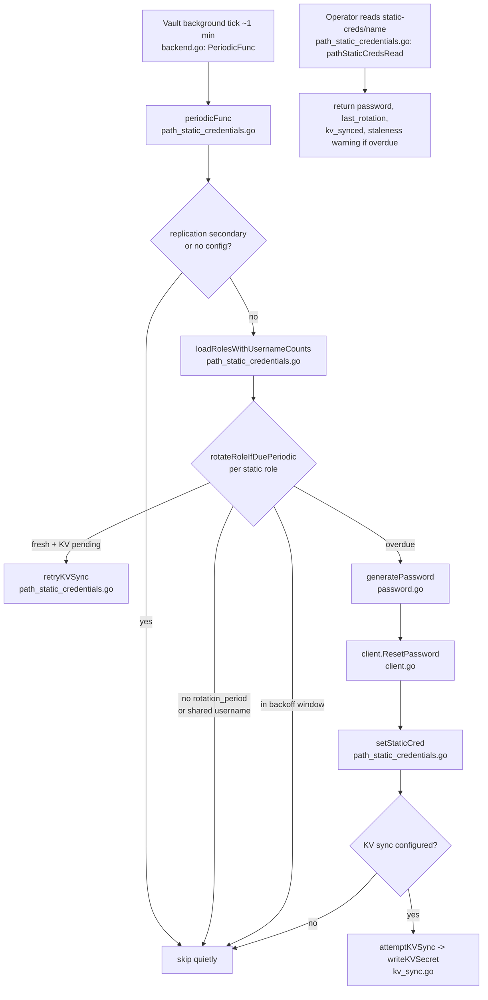
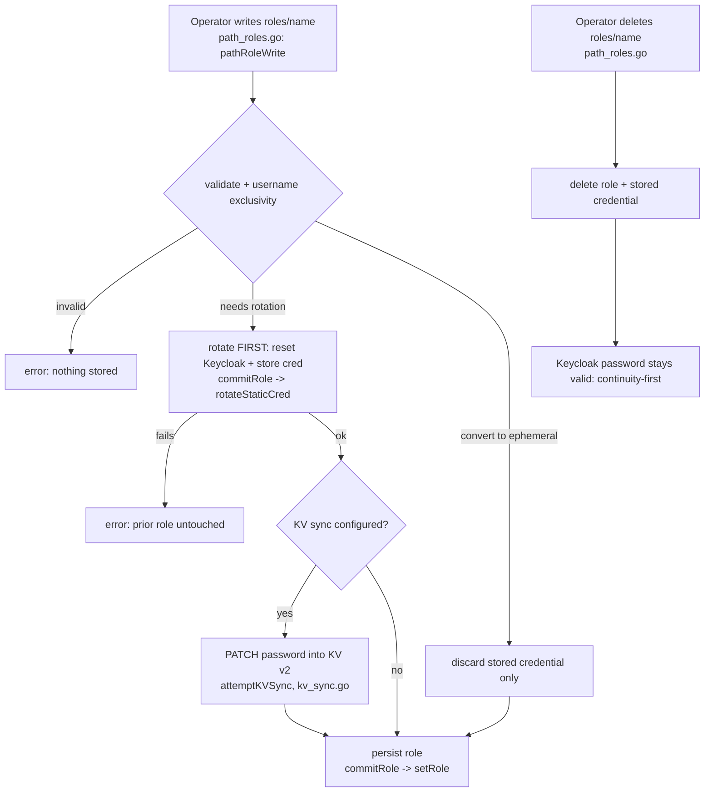
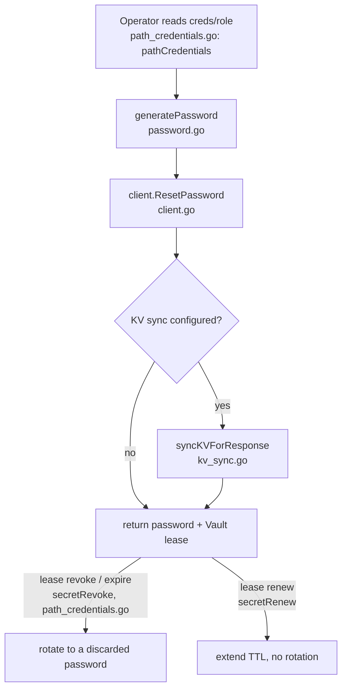
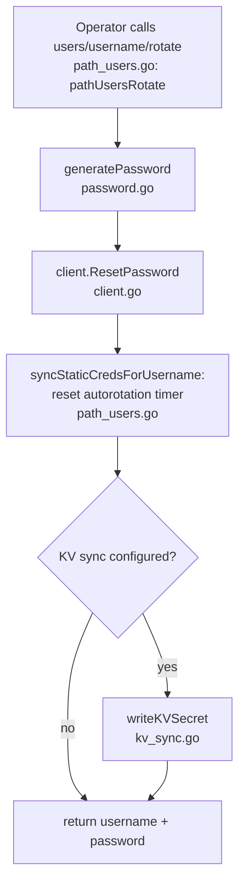
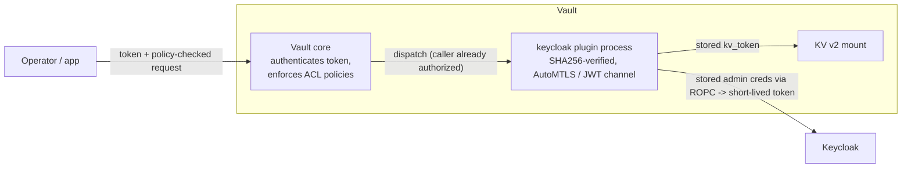

# Architecture

A contributor-facing map of how this plugin is built and where each operation
lives in the source. For the operator-facing process flows (without code
references) see the [README](../README.md#process-flow); for the rationale
behind the design decisions see the
[security review](security-review-v0.3.0.md).

The plugin is a single Go module (`github.com/RoFz/vault-plugin-secrets-keycloak`,
package `secretsengine`) built on the Vault SDK's `framework.Backend`. It runs
as a Vault plugin process and talks to Keycloak over its Admin REST API.

## What it does (capabilities)

The plugin manages passwords for **existing** Keycloak users (it never creates
or deletes users). It offers three credential modes plus an optional sync:

| Capability | Vault path | Value to the operator |
| --- | --- | --- |
| On-demand rotation | `users/<username>/rotate` | Rotate a Keycloak password on request; returns the new password. |
| Ephemeral credentials | `creds/<role>` | Lease-bound password, fresh on every read, never stored in Vault. |
| Static credentials (autorotated) | `static-creds/<name>` | A stable, owned password that the plugin rotates on a schedule. |
| KV v2 sync | (config) | Optionally mirror each new password into a KV v2 secret. |

## Endpoints

Every path the backend registers (`backend.go`). "write" means create/update.

| Path | Operations | Handler(s) | Purpose |
| --- | --- | --- | --- |
| `config` | read, write, delete | `pathConfigRead` / `pathConfigWrite` / `pathConfigDelete` | Keycloak connection + KV-sync settings. Write validates required fields, resets the cached client, warns when the Keycloak identity changes while roles exist, and logs a connection test. Read omits `master_admin_password` and `kv_token`. |
| `roles/<name>` | read, write, delete | `pathRoleRead` / `pathRoleWrite` / `pathRoleDelete` | Define an ephemeral or static role mapping a Vault role to a Keycloak username. Write validates mode-specific fields, enforces username exclusivity, and rotates-before-persist for static roles; delete is continuity-first. |
| `roles/` | list | `pathRoleList` | List role names. |
| `creds/<name>` | read | `pathCredentialsRead` | Ephemeral: mint a leased password (secret type `keycloak_password`; revoke discards the password, renew extends the lease without rotating). |
| `static-creds/<name>` | read | `pathStaticCredsRead` | Static: return the current autorotated password, with a staleness warning when overdue. |
| `users/` | list | `pathUsersList` | List usernames in the target realm (up to 500). |
| `users/<username>` | read | `pathUsersRead` | Read a user's details: id, enabled, email, first/last name. |
| `users/<username>/rotate` | write | `pathUsersRotate` | On-demand rotation of a user's password; resets the autorotation timer for any static roles on that username and syncs KV. |
| (background) | periodic | `periodicFunc` | Autorotation sweep, roughly every minute. |

## Context

## Source layout (code map)

Names below are stable search anchors; jump to them by symbol, not line number.

| File | Responsibility | Key symbols |
| --- | --- | --- |
| `cmd/vault-plugin-secrets-keycloak/main.go` | Plugin process entrypoint | `main` |
| `backend.go` | Backend wiring, client cache, periodic hook | `Factory`, `keycloakBackend`, `getClient`, `PeriodicFunc` |
| `path_config.go` | `config` read/write/delete, validation, identity-change warning | `pathConfig`, `keycloakConfig`, `pathConfigWrite` |
| `path_roles.go` | `roles/<name>` CRUD for both modes, validation | `pathRole`, `keycloakRoleEntry`, `commitRole`, `normalizeRole` |
| `path_credentials.go` | `creds/<role>` ephemeral, secret-type lease lifecycle | `pathCredentials`, `keycloakSecret`, `secretRevoke`, `secretRenew` |
| `path_static_credentials.go` | `static-creds/<name>` + autorotation sweep | `pathStaticCreds`, `periodicFunc`, `rotateRoleIfDuePeriodic`, `staticCredEntry` |
| `path_users.go` | `users` list/read/rotate | `pathUsers`, `pathUsersList`, `pathUsersRead`, `pathUsersRotate` |
| `client.go` | Keycloak Admin REST API client | `keycloakClient`, `ResetPassword`, `ListUsers`, `GetUser` |
| `kv_sync.go` | KV v2 sync helper | `writeKVSecret`, `kvSyncRequest`, `syncKVForResponse` |
| `password.go` | Random password generation | `generatePassword` |

## Process flows (operation → code)

Each step is labelled with the file (and function) that implements it.

### Static role autorotation

The plugin owns a Keycloak user's password and rotates it every
`rotation_period`; `static-creds/<name>` always returns the current password
(the same value between rotations). **Use it for** long-lived service accounts
and machine identities that need a *stable* credential consumers can re-read on
demand, while still meeting a rotation policy automatically , no leases for the
consumer to manage and no manual rotation toil.

### Static role lifecycle (write / convert / delete)

How a managed role is created, updated, converted between modes, and deleted ,
safely. Writes rotate *before* persisting (a failed rotation leaves the prior
role untouched), `keycloak_username` is exclusive across roles, and deletion is
continuity-first: the last Keycloak password keeps working. **Use it for** safe
day-2 operations , operators can reshape or remove managed identities without
locking out the Keycloak user or corrupting stored state, and decommissioning
Vault never breaks an existing login (useful for gradual adoption or rollback).

### Ephemeral credentials

Each read of `creds/<role>` mints a fresh password and returns it under a Vault
lease; the previous one is invalidated, and on lease expiry or revoke the
password is rotated to a discarded value. **Use it for** short-lived, on-demand
access (a human or job that needs temporary Keycloak access): zero standing
credentials, automatic expiry, and a full audit trail of who obtained access and
when , the classic Vault dynamic-secret pattern.

### On-demand rotation

Immediately rotates a named Keycloak user's password, resets the autorotation
timer for any static roles bound to that username, and syncs KV if configured.
**Use it for** break-glass and incident response (suspected compromise , rotate
now) or any out-of-schedule rotation; composed with a role delete it gives
revoke-on-demand without waiting for the periodic sweep.

## Concurrency and resilience

- **Single rotation lock** (`keycloakBackend.rotationLock`): the scheduled sweep
  uses `TryLock` and skips (never blocks) when a rotation is already running.
- **Failure backoff**: after consecutive failures a role waits
  `min(1min << (f-1), 16min)` before the next periodic attempt; freshness is
  never traded away (the next allowed attempt still rotates).
- **KV-sync retry**: a pending KV write (`kv_synced=false`) is retried on later
  ticks without rotating the password.
- **Replication guard**: `periodicFunc` is a no-op on DR/performance
  secondaries and performance standbys (read-only storage).
- **High availability**: autorotation writes run only on the **active node** of
  the primary cluster (the replication guard above is the hand-rolled equivalent
  of the SDK's `WriteSafeReplicationState`), so there is a single rotator and the
  in-process rotation lock is sufficient , no distributed lock is needed. Static
  credentials and `last_rotation` live in Vault's storage, replicated across the
  cluster and committed on quorum (the Raft log under Integrated Storage, or an
  external HA backend such as Consul), so after a failover the new active node
  already holds that state and continues rotating on schedule; the per-node backoff map and cached client simply reset and self-heal
  on the next tick. Regular (OSS) standbys forward requests to the active node;
  Enterprise performance standbys may serve read-only `static-creds` reads
  locally while forwarding rotations.

## Security model

The plugin sits behind two trust boundaries.

**Running trusted inside Vault (Vault <-> plugin).** External plugins run as a
separate process with Vault as the parent. Before starting it, Vault verifies
the plugin binary against the SHA256 registered in the plugin catalog, so only
the exact registered artifact runs. The Vault<->plugin channel is mutually
authenticated: AutoMTLS on Vault versions that support it, with a JWT
response-wrapping (unwrap) token to bootstrap otherwise. This plugin sets
`api.VaultPluginTLSProvider` in `cmd/vault-plugin-secrets-keycloak/main.go` for
backwards compatibility with pre-AutoMTLS Vault. All of this is core (OSS) Vault
behaviour.

**Authorizing callers and reaching downstream systems.**

- *Callers:* the plugin does not authenticate or authorize callers itself. Vault
  core authenticates the operator's token and enforces the ACL policies on the
  mount paths (`keycloak/config`, `keycloak/roles/*`, `keycloak/static-creds/*`,
  ...) before the request reaches the backend. Different operators are
  authorized independently against their own tokens and policies; concurrent
  requests are served concurrently and serialized where needed (the rotation
  lock).
- *Keycloak:* the plugin authenticates with a **stored admin credential**
  (`master_admin_username` / `master_admin_password` in `config`) using the
  OAuth2 Resource Owner Password Credentials (ROPC) grant, exchanging it for a
  **short-lived admin access token per operation** (`client.go`,
  `getAdminToken`).
- *KV v2 sync:* the plugin uses a **stored Vault token** (`kv_token`) to write
  the synced secret.
- The admin password and `kv_token` are **write-only**: accepted on config write
  and never returned on config read.

**Why stored credentials (the Enterprise trade-off).** The keyless alternative,
where the plugin presents a Vault-signed identity JWT to the external system in
exchange for short-lived credentials, is **Plugin Workload Identity Federation
(WIF)**, a **Vault Enterprise** capability implemented by the built-in cloud
secrets engines. An OSS-targeted custom plugin therefore stores a privileged
service credential in `config`, the standard model for OSS Vault secrets
engines. The mitigations above (write-only storage, short-lived derived tokens,
all access gated by Vault ACLs and recorded by Vault audit devices) keep that
credential's exposure bounded.

**Attribution.** Although every downstream action executes as the plugin's
single configured Keycloak identity, Vault's audit devices record which token or
entity issued each request, so individual operator actions remain attributable.

**Data at rest.** Everything the plugin persists (`config`, role definitions,
and stored static credentials) is written through Vault's storage layer, which
the barrier encrypts with AES-256-GCM before it reaches the storage backend. The
backend additionally opts `config`, `roles/*`, and `static-creds/*` into **seal
wrapping** (`PathsSpecial.SealWrapStorage` in `backend.go`) , an extra
encryption layer applied by the seal (e.g. an HSM/KMS auto-unseal) on top of the
barrier, for the most sensitive entries. The stored static password is therefore
never written in plaintext and is readable only via an ACL-authorized
`static-creds/<name>` read.

## Design decisions (the "why")

Architecturally significant decisions , rotate-before-persist, continuity-first
delete, username exclusivity, rotation atomicity (and the tracked crash-window,
issue #50) , are recorded in [security-review-v0.3.0.md](security-review-v0.3.0.md).

## Where to start reading

`backend.go` (`Factory` wires the paths and the `PeriodicFunc`) → the
`path_*.go` file for the operation you care about → `client.go` for the Keycloak
calls and `kv_sync.go` for the optional KV mirror.
